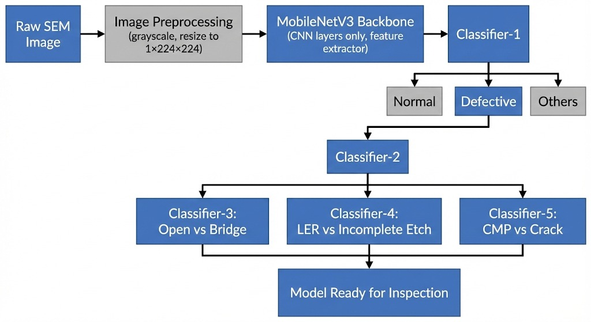

# SEM-HiNet: Hierarchical Industrial SEM Defect Classification

*Figure 1: Hierarchical Multi-Head Architecture for Intelligent Triage and Classification.*

## 🚀 Project Overview
**SEM-HiNet** is a deep learning framework designed for high-precision, high-speed semiconductor defect classification. It utilizes a **Multi-Head Hierarchical Architecture** built on an NXP-optimized **MobileNetV3** backbone.

The project addresses the "needle in a haystack" problem in industrial Scanning Electron Microscope (SEM) imaging by combining intelligent noise filtering (Gatekeeping) with specialized defect expertise (Specialist Heads).

## 🧠 Technical Approach
Our approach utilizes a single shared backbone to extract high-dimensional features, which are then processed by five parallel classification heads.

* **H1 (The Gatekeeper):** Separates valid SEM data (Normal/Defect) from industrial noise and outliers (Bogus).
* **H2 (The Router):** Directs defects into three primary geometric families: Line Defects, Area Defects, or Edge Defects.
* **H3–H5 (The Specialists):** Binary experts trained to distinguish between subtle textures (e.g., Bridge vs. Open, LER vs. Incomplete Etch).

### Key Training Innovations
* **Stratified Partitioning:** Mathematically ensures proportional class distribution across training and validation sets.
* **Weighted Head Loss:** Implements a custom loss function prioritizing specialist heads (H3-H5) with up to 8x weight to resolve leaf-node confusion.
* **QAT (Quantization-Aware Training):** Simulates 8-bit precision during training for zero accuracy loss on the **i.MX 8M Plus NPU**.

